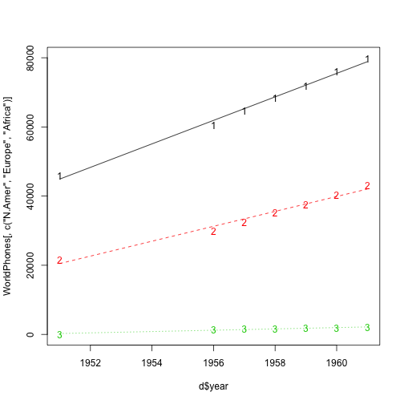

ReproduciblePitch - Ass4 ShinyApp 
========================================================
author: feideshu
date: March 16, 2018
autosize: true

See the app here: https://mjfilipski.shinyapps.io/Ass4_ShinyApp/ 


Goals of the app
========================================================

- Displays a plot of the number of telephones by year and region of the world
- Allows the user to select which regions to display on the plot
- Adds trendlines (for selected regions) 
- Displays the yearly rate of growth (for selected regions)

Data used in the app 
========================================================

```r
data("WorldPhones")
WorldPhones[,1:4]
```

```
     N.Amer Europe Asia S.Amer
1951  45939  21574 2876   1815
1956  60423  29990 4708   2568
1957  64721  32510 5230   2695
1958  68484  35218 6662   2845
1959  71799  37598 6856   3000
1960  76036  40341 8220   3145
1961  79831  43173 9053   3338
```
Full dataset has 7 regions.  It is native to RStudio.  
Manipulations in Server.R include an "lm" command and a "predict"


The basic plot
========================================================

```r
# Here, only 3 regions selected
matplot( d$year, WorldPhones[,c("N.Amer", "Europe", "Africa")])
matlines(d$year,p)
```




Rate of growth of telephones
========================================================
The app also displays a table such as the following:

```r
t <- data.frame(Region=c("N.Amer", "Europe", "Africa"), Slope=fit$coefficients[2,])
print(t, row.names=FALSE)
```

```
 Region     Slope
 N.Amer 3396.7391
 Europe 2155.7674
 Africa  190.8109
```
With the option of selecting up to 6 regions
